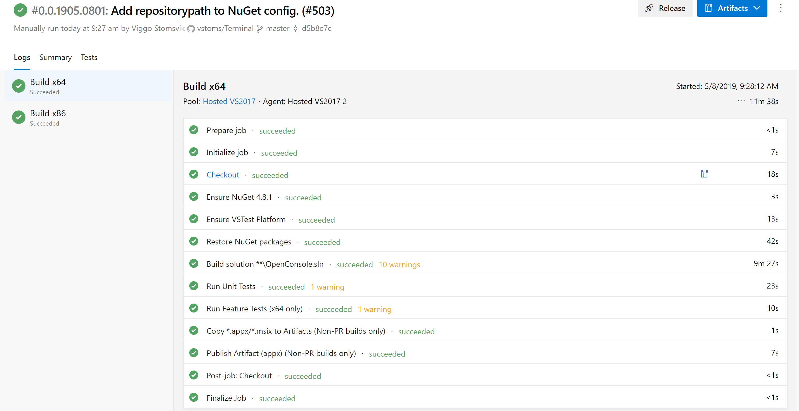

Microsoft announced under //Build 2019, Windows Terminal is a new, modern, fast, efficient, powerful, and productive terminal application for users of command-line tools and shells like Command Prompt, PowerShell, and WSL.



Windows Terminal will be delivered via the Microsoft Store in Windows 10 and will be updated regularly, ensuring you are always up to date and able to enjoy the newest features and latest improvements with minimum effort.

> The Windows Terminal is in the very early alpha stage, and not ready for the general public quite yet, so do not use this in any production environment yet.

##### Prerequisites

- Windows 1903
- Certificate (We will install this later)
- Github account
- Azure DevOps account
- MSIX Packaging Tool

##### Build Windows Terminal in Azure DevOps

- Fork [Microsoft/Terminal](https://github.com/microsoft/Terminal) to your repositories
- Go to [Azure DevOps site](https://dev.azure.com) and log in (If you don`t have any account create one, Its free.)
- Create an new project (Im calling it Terminal here.)


- Navigate to __Pipelines__ -> __Builds__ and click __New__ -> __New build pipeline__
- Choose where your code is, our code is on GitHub


- Select a repository where you fork is located.


- Configure your pipeline, choose __Existing Azure Pipeline YAML files__


- Next select your YAML file, __/build/pipelines/ci.yaml__


- Click __Run__ and the pipeline will configure and start the job.


- Now the job will go through all the steps


- In the end, you will end up with this, and you can now get the files under __Artifacts__. But it will now be installed yet, we need to inject a certificate into the .msix file first.



##### Inject SSL Certificate into .msix applicaiton.

Before we can install this .msix application, we first need to get a certificate and the easiest way is to create a self-signed certificate.

Run from Powershell:

```
New-SelfSignedCertificate -Type Custom -Subject "CN=Contoso Software, O=Contoso Corporation, C=US" -KeyUsage DigitalSignature -FriendlyName <Your Friendly Name> -CertStoreLocation "Cert:\LocalMachine\My"
```
Export the certificate if you want to use the certificate on another computer, and copy the certificate into the Local Computer Trusted Root Certification Authorities store.

- Next start MSIX Packaging Tool (If you dont have it, grab it from Microsoft Store)
- Click __Package Editor__


- Find your .msix package and open it.
  


- Under sign package, import your private cert and type in the password you gave it.


- Next press apply, and you will get a message if you want to update the version of this package or not.


Now you have a msix application that you can install into your computer.

##### Settings

After open the terminal, you can't see any menu buttons.

Just press Ctrl + T to open a new tab, then you'll see a drop-down button in the tab bar.

Click it and select Settings, then you can modify the configuration via opened profiles.json

##### Add WSL

- Create a new session in profiles, with content copied from profiles/cmd
- Give it a new guid
- Give it a new name, such as WSL
- Specify its commandline to wsl.exe
- Then you'll find WSL in the drop-down menu of tab bar.

Here're sample codes:

```json
{
    "guid": "{09dc5eef-6840-4050-ae69-21e55e6a2e62}",
    "name": "WSL",
    "colorscheme": "Campbell",
    "historySize": 9001,
    "snapOnInput": true,
    "cursorColor": "#FFFFFF",
    "cursorShape": "bar",
    "commandline": "wsl.exe",
    "fontFace": "Consolas",
    "fontSize": 12,
    "acrylicOpacity": 0.75,
    "useAcrylic": true,
    "closeOnExit": false,
    "padding": "0, 0, 0, 0"
}
```

[Scott Hanselmans Windows Terminal Profile on GitHub](https://gist.github.com/shanselman/221ef38d035fcf2836d664009f144eac)